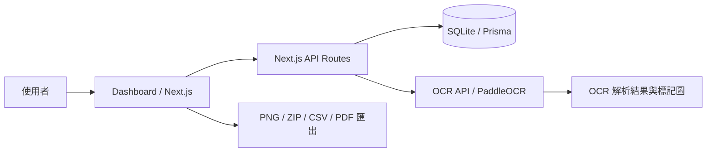

# LCR OCR Dashboard

石墨晶舟 LCR 量測資料管理、OCR 解析與 Dashboard 分析系統。

本專案提供一個 Next.js Dashboard，用來管理 LCR 量測 dataset / records，並可透過獨立的 PaddleOCR API 解析量測圖片。使用者可以在 Dashboard 比較 Dataset / Baseline、查看圖表，並匯出 A4 比較報告 PDF、多資料比較圖 PNG、Scale Bar ZIP 與比較表 CSV。

## 專案簡介

這個系統主要用於：

- 管理 LCR 量測資料與量測批次。
- 使用 OCR API 解析 LCR / 量測圖片並預填資料。
- 建立與選擇 Baseline。
- 在 Dashboard 比較多組 Dataset 的 Rp / Cp / Rs / Cs。
- 匯出 A4 比較報告 PDF、多資料比較圖 PNG、Scale Bar ZIP、比較表 CSV。

## 系統架構



目前專案沒有獨立後端服務；前端 Dashboard 與 API routes 都由 Next.js 提供。OCR API 是獨立 FastAPI / PaddleOCR 服務，通常用 Docker 啟動。

## 主要功能

- 量測資料管理：建立、查看、編輯 Dataset 與 Records。
- OCR 解析：上傳量測圖片，呼叫 `/api/ocr`，再由 Next.js 轉呼叫 PaddleOCR 服務。
- Baseline 管理：建立、編輯與套用 Baseline。
- Dataset 比較：選擇多個 Dataset 或 Baseline 進行比較。
- Dashboard 圖表：多資料比較圖與單一參數 Scale Bar。
- 匯出功能：A4 比較報告 PDF、多資料比較圖 PNG、Scale Bar ZIP、比較表 CSV。

## 環境需求

- Node.js：建議 Node.js 20 LTS；本專案目前以 Node.js v20.20.2 驗證。
- npm：本專案有 `package-lock.json`，請優先使用 npm。
- Docker：用於啟動 OCR API。
- NVIDIA GPU 與 NVIDIA Container Toolkit：目前 OCR API 固定使用 `device="gpu:0"`。
- Prisma / SQLite：本機資料庫使用 `DATABASE_URL="file:./dev.db"`。
- OCR image：由 `servers/ocr/Dockerfile` 建立，container 內 uvicorn port 是 `8000`。

目前 OCR API 未整理 CPU 模式；若沒有 NVIDIA GPU，請先視為 OCR API 不可用。

## Clone 專案

```bash
git clone <repo-url>
cd <project-folder>
```

`<repo-url>` 與 `<project-folder>` 請依實際 GitHub repository 調整。

## 安裝前端依賴

```bash
npm install
```

## 環境變數設定

複製範本：

```bash
cp .env.example .env
```

Windows PowerShell：

```powershell
Copy-Item .env.example .env
```

重要設定：

```bash
LCR_PORT=3100
LCR_HOST=127.0.0.1
DATABASE_URL="file:./dev.db"
OCR_API_URL="http://localhost:8001"
OCR_API_TIMEOUT_MS="30000"
```

說明：

- `LCR_PORT`：Dashboard / Next.js 的主機 port，預設 `3100`。
- `LCR_HOST`：Dashboard 綁定 host，預設 `127.0.0.1`。
- `DATABASE_URL`：Prisma SQLite 資料庫位置。
- `OCR_API_URL`：Next.js API routes 呼叫 OCR API 的位置。
- 如果 OCR API 主機 port 改了，`OCR_API_URL` 也要一起改。
- Docker Compose 內部服務互相呼叫時，不一定能用 `localhost`，通常要改成 service name，例如 `http://lcr-ocr-api:8000`。

## 初始化資料庫

本專案使用 Prisma + SQLite。clone 後請建立本機資料庫：

```bash
npm run prisma:generate
npm run prisma:migrate
```

如需示範資料，可執行：

```bash
npm run db:seed
```

示範資料來源在 `prisma/seed.ts`。

## 啟動 Dashboard

```bash
npm run dev
```

預設網址：

```text
http://localhost:3100
```

如果 `.env` 的 `LCR_PORT` 改成 `3200`，網址就改為：

```text
http://localhost:3200
```

## 建立 OCR Docker Image

OCR Dockerfile 位於 `servers/ocr/Dockerfile`。可從專案根目錄 build：

```bash
docker build -t lcr-ocr -f servers/ocr/Dockerfile servers/ocr
```

也可以切到 OCR 目錄 build：

```bash
cd servers/ocr
docker build -t lcr-ocr .
```

## 啟動 OCR API

以下 `-v ${PWD}:/app` 指令請在 `servers/ocr` 目錄執行，讓 `/app/main.py` 對應到 OCR API 程式碼。

PowerShell：

```powershell
cd servers/ocr
docker run --rm --gpus all --name lcr-ocr-api -p 8001:8000 -v ${PWD}:/app lcr-ocr
```

Git Bash：

```bash
cd servers/ocr
docker run --rm --gpus all --name lcr-ocr-api -p 8001:8000 -v "$(pwd)":/app lcr-ocr
```

Port 說明：

- `8001` 是主機 port，可以依使用者環境修改。
- `8000` 是 container 內 uvicorn port，來自 `servers/ocr/Dockerfile`，通常不要改。
- 如果改成 `-p 8010:8000`，`.env` 內要同步改成 `OCR_API_URL="http://localhost:8010"`。
- `--gpus all` 需要 NVIDIA GPU 與 NVIDIA Container Toolkit。

健康檢查：

```bash
curl http://localhost:8001/health
```

## 操作流程

1. 啟動 OCR API。
2. 啟動 Dashboard。
3. 開啟 `http://localhost:3100`。
4. 到「新增量測資料」手動輸入或上傳圖片執行 OCR。
5. 儲存 Dataset。
6. 到「Baseline 管理」建立或確認 Baseline。
7. 到「量測分析 Dashboard」選擇 Dataset / Baseline。
8. 查看多資料比較圖、Scale Bar 與比較資料表。
9. 匯出 PDF 報告，或下載 Compare PNG / Scale Bar ZIP / CSV。

## 匯出功能

目前支援：

- `compare-report-YYYYMMDD.pdf`：主要交付格式。Dashboard 會開啟瀏覽器列印視窗，請選擇「另存為 PDF」。報告包含比較資訊摘要、比較資料表、多資料比較圖與 Rp / Cp / Rs / Cs Scale Bar。
- `compare-overview-YYYYMMDD.png`：多資料比較圖（Parallel Coordinates）PNG。
- `scale-charts-YYYYMMDD.zip`：Scale Bar 圖表 ZIP，內含 `scale-rp.png`、`scale-cp.png`、`scale-rs.png`、`scale-cs.png`。
- `compare-table-YYYYMMDD.csv`：比較資料表 CSV，欄位與 Dashboard 表格一致，並加入 UTF-8 BOM，方便 Excel 開啟中文。

## 更多文件

- [使用者操作手冊](docs/user-guide.zh-TW.md)：給使用者看，說明如何操作系統與匯出結果。
- [部署說明](docs/deployment.zh-TW.md)：給部署或維護者看，說明 Docker、port、GPU 與常見部署問題。

## 常見問題

### Port 被占用

前端 port 可改 `.env`：

```bash
LCR_PORT=3200
```

OCR API 主機 port 可改 `docker run -p` 左邊：

```bash
docker run --rm --gpus all --name lcr-ocr-api -p 8010:8000 -v ${PWD}:/app lcr-ocr
```

同時修改：

```bash
OCR_API_URL="http://localhost:8010"
```

### OCR API 連不上

請確認：

- OCR container 是否正在執行。
- `OCR_API_URL` 是否指向正確主機 port。
- `curl http://localhost:8001/health` 是否回傳 `{"status":"ok"}`。
- Docker Compose 內部服務互相呼叫時是否誤用 `localhost`。

### Docker 找不到 GPU

先測試：

```bash
docker run --rm --gpus all nvidia/cuda:12.0.0-base-ubuntu22.04 nvidia-smi
```

如果失敗，請檢查 NVIDIA driver、Docker Desktop GPU 支援與 NVIDIA Container Toolkit。

### PaddleOCR / paddlex 版本相容問題

專案背景曾因版本相容性固定使用：

```bash
pip install "paddleocr[all]==3.2.0"
pip install langchain==0.0.354
```

但目前 `servers/ocr/requirements.txt` 仍是未釘版的 `paddleocr`，且程式碼沒有直接 import `langchain`。若 OCR image 重建後出現 PaddleOCR / paddlex 錯誤，請優先檢查 requirements 版本並依實際驗證結果釘版。

### Dashboard 沒有資料

請確認：

- 已建立 Dataset。
- OCR 或手動輸入已成功儲存 records。
- Prisma migration 已執行。
- `/api/measurements` 沒有 server error。

### GitHub 上傳前注意

- `.env.example` 應被提交，`.env` / `.env.local` 不應提交。
- `dev.db`、OCR runtime data、`.next/`、`node_modules/` 不應提交。
- 目前沒有 LICENSE；若要公開發布，建議補授權條款。
- 目前沒有 screenshots；建議未來補 Dashboard 截圖與 OCR 流程圖。
