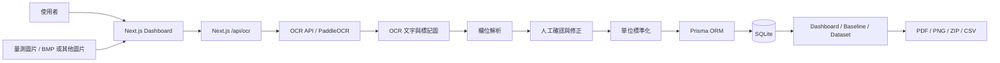

# 基於影像辨識（OCR）之石墨晶舟阻抗量測資料擷取與分析系統

**OCR-Based Impedance Measurement Data Extraction and Analysis System for Graphite Boats**

本系統用於整理 LCR Meter 量測後產生的阻抗量測資料，將原本仰賴人工抄寫、比對與整理的流程，轉換為可在本機執行的數位化工作流程。系統透過 PaddleOCR 解析量測圖片，使用 Next.js 建立資料管理與分析介面，並以 Prisma / SQLite 儲存 Dataset、Records、Baseline 與 OCR 相關資訊。

## 專案介紹

石墨晶舟在製程前後需要透過 LCR Meter 量測 Rp、Cp、Rs、Cs 等阻抗相關參數。實務流程中，量測結果常以圖片或畫面截圖保存，再由使用者人工整理成表格，容易產生輸入錯誤，也不利於後續比較多組條件、追蹤 Baseline 與產生正式報告。

本系統的目標是建立一套本地端資料擷取與分析平台，將量測圖片上傳後交由 OCR API 解析，再由前端表格讓使用者確認與修正，最後存入資料庫並在 Dashboard 中進行 Dataset / Baseline 比較。整體流程以「可人工覆核」為前提，讓 OCR 成為加速資料輸入的工具，而不是取代使用者判斷。

## 系統特色

- 量測圖片 OCR：支援上傳 LCR Meter 量測圖片，透過 PaddleOCR API 預填表格資料。
- 自動欄位解析：解析 FREQ、LEVEL、Rp、Cp、Rs、Cs，並保留原始單位與標準化後數值。
- OCR Tracking：可記錄 OCR 初始辨識值與使用者修正後數值，用於計算 record-level 準確率。
- Dataset 管理：可建立新 Dataset，也可將 records 加入既有 Dataset。
- Baseline 管理：可建立、編輯與套用 Baseline 參考值。
- Dashboard 比較：支援多組 Dataset / Baseline 比較、平行座標圖與單一參數 Scale Bar。
- 單位標準化：儲存時轉換為 Hz、V、Ω、F，顯示時可切換標準單位與友善單位。
- 報告匯出：支援 A4 PDF、比較圖 PNG、Scale Bar ZIP、比較表 CSV。
- 本地部署：OCR API 與 Dashboard 可在本機或內部環境執行，量測圖片不需要上傳雲端服務。

## 系統架構



目前專案沒有獨立的後端 API 服務；Dashboard 與資料 API routes 由 Next.js 提供。OCR API 是獨立 FastAPI / PaddleOCR 服務，可用 Docker 建立與啟動。

## 技術架構

| 分層 | 技術 |
| --- | --- |
| Frontend | Next.js App Router、React、TypeScript |
| UI | Tailwind CSS、shadcn/ui、lucide-react |
| Backend | Next.js Route Handlers |
| ORM / Database | Prisma、SQLite |
| OCR API | FastAPI、PaddleOCR、Pillow、OpenCV headless |
| OCR Runtime | Docker、PaddlePaddle Docker image |
| Chart / Export | SVG chart、Recharts、瀏覽器列印 PDF、CSV / PNG / ZIP 匯出 |

## 快速開始

### 1. Clone 專案

```bash
git clone <repo-url>
cd <project-folder>
```

### 2. 安裝前端依賴

```bash
npm install
```

### 3. 建立環境變數

Linux / macOS / Git Bash：

```bash
cp .env.example .env
```

Windows PowerShell：

```powershell
Copy-Item .env.example .env
```

主要設定如下：

```env
LCR_PORT=3100
LCR_HOST=127.0.0.1
DATABASE_URL="file:./dev.db"
OCR_API_URL="http://localhost:8001"
OCR_API_TIMEOUT_MS="30000"
OCR_ACCURACY_TRACKING_ENABLED=true
NEXT_PUBLIC_OCR_ACCURACY_TRACKING_ENABLED=true
```

### 4. 初始化資料庫

```bash
npm run prisma:generate
npm run prisma:migrate
```

如需建立示範資料：

```bash
npm run db:seed
```

### 5. 建立 OCR Docker Image

```bash
docker build -t lcr-ocr -f servers/ocr/Dockerfile servers/ocr
```

### 6. 啟動 OCR API

PowerShell：

```powershell
cd servers/ocr
docker run --rm --gpus all --name lcr-ocr-api -p 8001:8000 -v ${PWD}:/app lcr-ocr
```

Git Bash：

```bash
cd servers/ocr
docker run --rm --gpus all --name lcr-ocr-api -p 8001:8000 -v "$(pwd)":/app lcr-ocr
```

OCR API 預設對外位址為：

```text
http://localhost:8001
```

### 7. 啟動 Dashboard

回到專案根目錄：

```bash
npm run dev
```

預設網址：

```text
http://localhost:3100
```

完整部署與 port 設定請參考 [docs/deployment.zh-TW.md](docs/deployment.zh-TW.md)。

## 文件

- [使用者操作手冊](docs/user-guide.zh-TW.md)：說明如何新增量測資料、執行 OCR、管理 Dataset / Baseline、查看 Dashboard 與匯出報告。
- [部署說明](docs/deployment.zh-TW.md)：說明 Docker、OCR API、PaddleOCR 參考文件、port 與常見部署問題。

## 聯絡與回饋

若在部署、使用或開發本系統時遇到任何問題，或有任何建議與改善想法，歡迎來信聯繫：

黃世穎

Email：

shi0214ying@gmail.com

歡迎提供任何使用回饋與改善建議。
